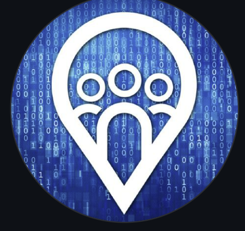

<a name="readme-top"></a>
<br />
<div align="center">
  <a href="https://github.com/github_username/repo_name">
    
  </a>
<h3 align="center">Creating sales domain adapted language model using llama 13B chat</h3>

  <p align="center">
    project_description
    <br />
    <a href="https://github.com/github_username/repo_name"><strong>Explore next steps »</strong></a>
    <br />
    <br />
  </p>
</div>


<!-- ABOUT THE PROJECT -->
## About The Project

The first step of our project is adapting our model to the sales domain This repository will help us do that.


### Major steps done in this project

* Downloading LLama 13b chat from Hugging Face
* Downloading and mapping dataset that will be used for finetuning
* Finetuning our model using Peft and Lora
* Merging the lora to the base model
* uploading the finetuned model to the hub


<p align="right">(<a href="#readme-top">back to top</a>)</p>

<!-- GETTING STARTED -->
## Getting Started

This is an example of how we can finetune on our model on a specific data you may give instructions on setting up your project locally or on a runpod instance.
To get a copy up and running follow these simple example steps.
But to change the fine tuning dataset u need to change the dataset used in finetune.py.

### Prerequisites

GPU instance is required

### Installation

1. Go to your terminal
2. Clone the repo
   ```sh
   https://github.com/Leulassaminew/finetune-llama-13-b-chat.git
   ```
3. change to the cloned directory
   ```sh
   cd finetune-llama-13-b-chat
   ```
4. Install requirements `requirements.txt`
   ```js
   pip install -r requirements.txt
   ```
4. Iupdate datasets package
   ```js
   pip install -U datasets
   ```

<p align="right">(<a href="#readme-top">back to top</a>)</p>


<!-- USAGE EXAMPLES -->
## Usage

Now we can start the fine tuning


<p align="right">(<a href="#readme-top">back to top</a>)</p>


<!-- ROADMAP -->
## Roadmap

- [ ] Now run the Fine tuning file
   ```js
   python finetune.py
   ```
- [ ] next step is to merge the lora checkpoint
  ```js
   python merge.py
   ```   
- [ ] And finally we will push the merged model to the hub
   ```js
   python upload.py
   ```

Now we can find the [Fine Tuned Model here](https://huggingface.co/).

<p align="right">(<a href="#readme-top">back to top</a>)</p>


<!-- MARKDOWN LINKS & IMAGES -->
<!-- https://www.markdownguide.org/basic-syntax/#reference-style-links -->
[contributors-shield]: https://img.shields.io/github/contributors/github_username/repo_name.svg?style=for-the-badge
[contributors-url]: https://github.com/github_username/repo_name/graphs/contributors
[forks-shield]: https://img.shields.io/github/forks/github_username/repo_name.svg?style=for-the-badge
[forks-url]: https://github.com/github_username/repo_name/network/members
[stars-shield]: https://img.shields.io/github/stars/github_username/repo_name.svg?style=for-the-badge
[stars-url]: https://github.com/github_username/repo_name/stargazers
[issues-shield]: https://img.shields.io/github/issues/github_username/repo_name.svg?style=for-the-badge
[issues-url]: https://github.com/github_username/repo_name/issues
[license-shield]: https://img.shields.io/github/license/github_username/repo_name.svg?style=for-the-badge
[license-url]: https://github.com/github_username/repo_name/blob/master/LICENSE.txt
[linkedin-shield]: https://img.shields.io/badge/-LinkedIn-black.svg?style=for-the-badge&logo=linkedin&colorB=555
[linkedin-url]: https://linkedin.com/in/linkedin_username
[product-screenshot]: images/screenshot.png
[Next.js]: [https://img.shields.io/badge/next.js-000000?style=for-the-badge&logo=nextdotjs&logoColor=white](https://huggingface.co/)
[Next-url]: [https://nextjs.org/](https://huggingface.co/)
[React.js]: https://img.shields.io/badge/React-20232A?style=for-the-badge&logo=react&logoColor=61DAFB
[React-url]: https://reactjs.org/
[Vue.js]: https://img.shields.io/badge/Vue.js-35495E?style=for-the-badge&logo=vuedotjs&logoColor=4FC08D
[Vue-url]: https://vuejs.org/
[Angular.io]: https://img.shields.io/badge/Angular-DD0031?style=for-the-badge&logo=angular&logoColor=white
[Angular-url]: https://angular.io/
[Svelte.dev]: https://img.shields.io/badge/Svelte-4A4A55?style=for-the-badge&logo=svelte&logoColor=FF3E00
[Svelte-url]: https://svelte.dev/
[Laravel.com]: https://img.shields.io/badge/Laravel-FF2D20?style=for-the-badge&logo=laravel&logoColor=white
[Laravel-url]: https://laravel.com
[Bootstrap.com]: https://img.shields.io/badge/Bootstrap-563D7C?style=for-the-badge&logo=bootstrap&logoColor=white
[Bootstrap-url]: https://getbootstrap.com
[JQuery.com]: https://img.shields.io/badge/jQuery-0769AD?style=for-the-badge&logo=jquery&logoColor=white
[JQuery-url]: https://jquery.com 
